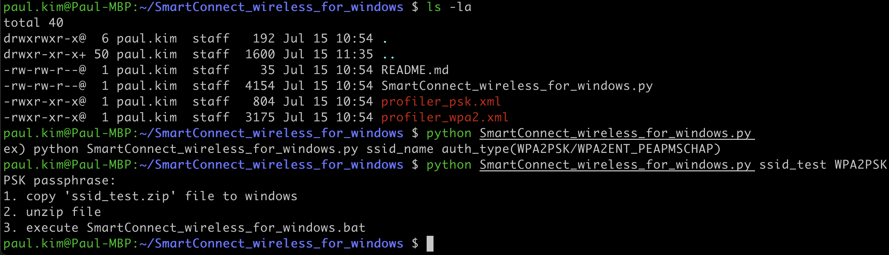
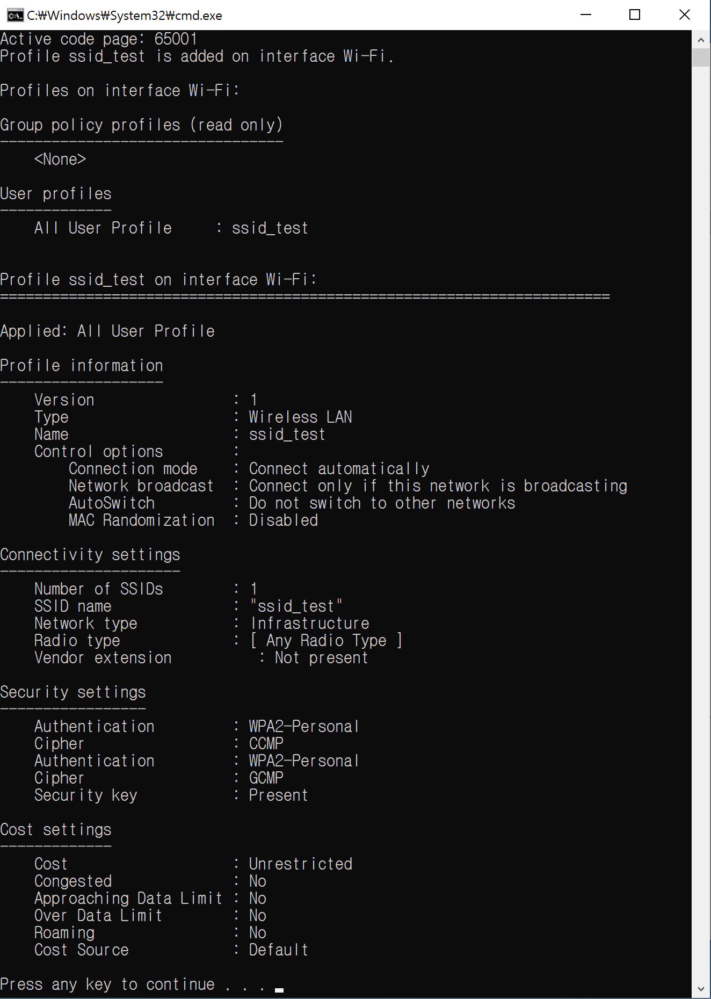

# SmartConnect_wireless_for_windows

### Description
To use wireless 802.1x authentication in Windows, you must add a profile. 
(in the past, I used to use quickconnect. but now, quickconnect is EoS)

Customers want to add profile for wireless authentication easily.

So I created python script and windows batch file for adding wireless profile 
Just double-click SmartConnect_wireless_for_windows.bat to add wireless profile for Windows

### How to run

1. download SmartConnect_wireless_for_windows 

https://github.com/aruba-paulkim/SmartConnect_wireless_for_windows

2. run python script with your ssid name and auth type for your own profile

2. copy ssid_name.zip to windows client

3. unzip file and run(double-click) SmartConnect_wireless_for_windows.bat

6. check result
